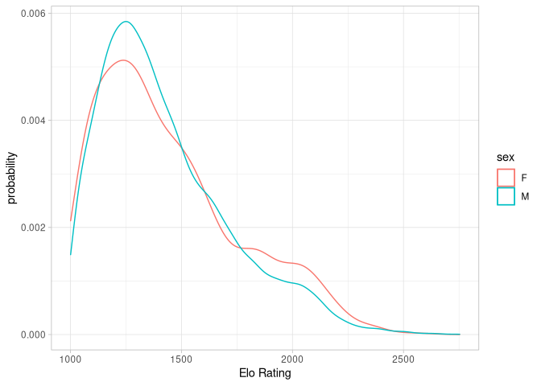
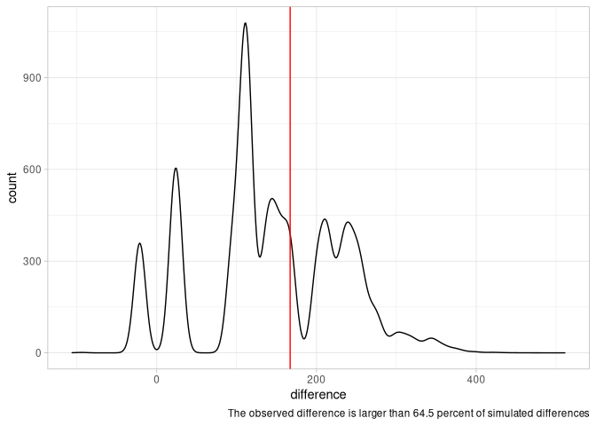
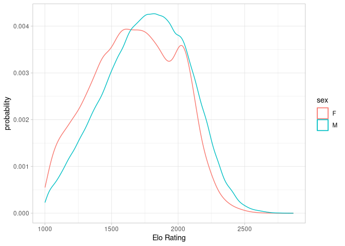
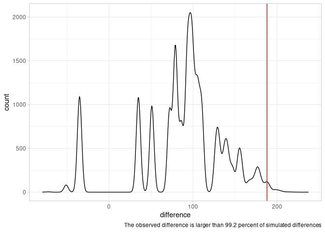
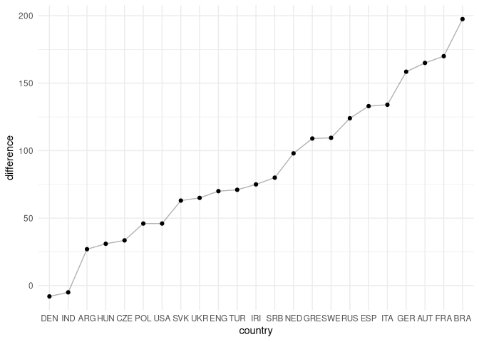

Gender Differences in Chess
================

Background
----------

Professor Wei Ji Ma recently posted an
[article](https://en.chessbase.com/post/what-gender-gap-in-chess) on
[chessbase](https://chessbase.com) in which he analyzed gender
differences in the performance of chess players in India.

His basic argument is this: Often, people claim that women are worse at
chess and point to the low number of female chess players among the all
the top chess players in the world. While the observation is correct,
according to Professor Ma, the conclusion is false. The reason is that
comparing the maximum values is a very bad way of comparing two
distributions. He finds that indeed women in India are likely
overperforming given what we should expect from the low overall number
of women in chess.

In the following I replicate his analysis and also look at the entire
world, not only India. A blog post on the topic can be found
(here)\[<a href="https://followtheargument.org/gender-differences-among-top-performers-in-chess" class="uri">https://followtheargument.org/gender-differences-among-top-performers-in-chess</a>\].

Replication: Analysis of gender differences in India
----------------------------------------------------

### Relative performance of men and women in India

<!-- -->

### Basic summary statistics India

    ## # A tibble: 2 x 5
    ##   sex   number  mean median    sd
    ##   <chr>  <int> <dbl>  <dbl> <dbl>
    ## 1 F       1373 1443.   1364  319.
    ## 2 M      19159 1425.   1359  290.

### Performance of best players in India

    ## # A tibble: 2 x 5
    ##   sex   number  mean median    sd
    ##   <chr>  <int> <dbl>  <dbl> <dbl>
    ## 1 F          1  2586   2586    NA
    ## 2 M          1  2753   2753    NA

### Actual difference top-performers

    ## [1] 167

### Mean difference top-performers in permutation analysis

    ## [1] 143.4728

### Distribution of differences in permuataion analysis

<!-- -->

New Analysis: Gender Differences in the World
---------------------------------------------

### Relative performance of men and women in the world

<!-- -->

### Basic summary statistics

    ## # A tibble: 2 x 5
    ##   sex   number  mean median    sd
    ##   <chr>  <int> <dbl>  <dbl> <dbl>
    ## 1 F      20012 1674.   1679  317.
    ## 2 M     243375 1761.   1774  313.

### Performance of top players in the world

    ## # A tibble: 2 x 5
    ##   sex   number  mean median    sd
    ##   <chr>  <int> <dbl>  <dbl> <dbl>
    ## 1 F          1  2675   2675    NA
    ## 2 M          1  2863   2863    NA

### Actual difference top-performers

    ## [1] 188

### Mean difference top-performers in permutation analysis

    ## [1] 88.4682

### Distribution of differences in permuataion analysis

<!-- -->

Differences in median performances across countries
---------------------------------------------------

Only countries with 1000 or more registered players are taken into
account
<!-- -->

### Correlation between performance differences and the proportion of female players

    ## [1] 0.1161931
